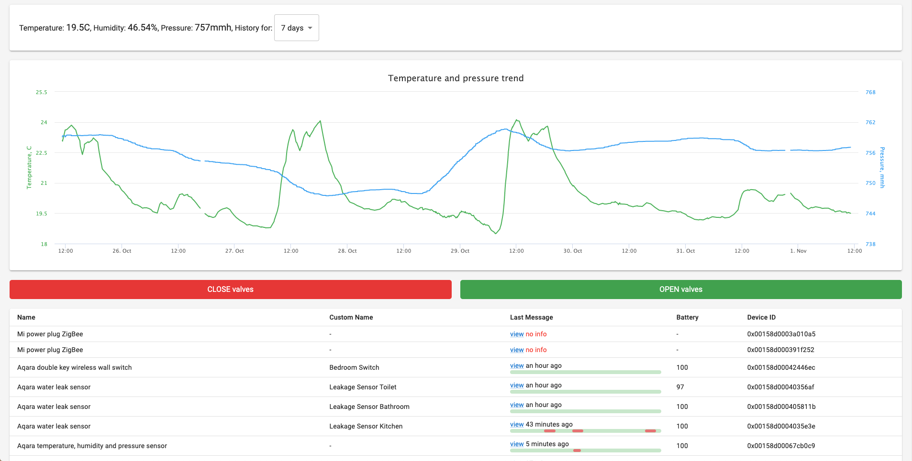

### Home automation server and playground for new technologies

Simple home automation server (my simple and custom-made alternative for [Home Assistant](https://www.home-assistant.io/))
Zigbee devices support is enabled with help of [zigbee2mqtt](https://www.zigbee2mqtt.io/) project and chineeze clone of Texas Instruments CC2531 stick.
Browser part is implemented on react + emotion + materialui. Parcel2 is used as module bundler.
Server side code is written in nodejs + typescript, babel as bundler/loader.

<!-- This GUI is also connected to MQTT broker.  -->
<!-- This project has initially started as co2 sensor box with MQTT interface.  -->
<!-- CO2 sensor hardware is implemented on top of esp8266 ([firmware, written on lua](https://github.com/fedulovivan/interstellar/tree/master/nodemcu/mqtt.lua)), flashed with nodemcu and connected to MQTT broker [mosquitto](https://mosquitto.org/).
 -->
<!-- All received metrics are saved into coachdb which allows to browse historical data. -->
<!-- Browser-server communication is implemented as RPC layer over websockets. -->

### Used technologies

- [typescript](https://www.typescriptlang.org/index.html) 4.0
- [react](https://reactjs.org/) 17 and useSate, useEffect, useReducer [react hooks](https://reactjs.org/docs/hooks-intro.html)
- [emotion](https://emotion.sh/) as styled components library
- [immer](https://immerjs.github.io/immer/docs/introduction) in reducer
- [parcel2](https://v2.parceljs.org/) with hot reload enabled
- [eslint](https://eslint.org/) with airbnb presets
- [mqtt](https://www.npmjs.com/package/mqtt) client
- [yeelight-platform](https://github.com/sahilchaddha/yeelight-platform) for integration with yeelight devices
- [materialui](https://next.material-ui.com/) 5.0
- [debug](https://www.npmjs.com/package/debug) module
- [sqlite3](https://www.sqlite.org/) databese with nodejs [sqlite3 client](https://www.npmjs.com/package/sqlite3)
- [import-sorter](https://github.com/SoominHan/import-sorter) for VS Code
- [axios](https://github.com/axios/axios) as http client
- [pm2](https://pm2.keymetrics.io/) as daemon process manger (backend watchdog)
- no redux, no create-react-app
- relative paths for imports
<!-- - RPC layer implemented over [socket.io](https://socket.io/) -->
<!-- - [couchdb](https://couchdb.apache.org/) -->
<!-- - [react-vis](https://uber.github.io/react-vis/) charting library -->

### UI screen

### Scripts

- `build` build production client-side bundle
- `start` launch server in production mode
- `stop` stop production server
- `list` list of pm2 processes
- `parcel:dev` launch parcel in devevelopment mode
- `server:dev` launch server in device mode (with debug enabled)
- `all:dev` `parcel:dev` + `server:dev`

<!-- ### TODOs
- why cssinjs? https://medium.com/jobsity/css-in-javascript-with-jss-and-react-54cdd2720222
- choosing cssinjs implementation - https://github.com/streamich/freestyler/blob/master/docs/en/generations.md -->

