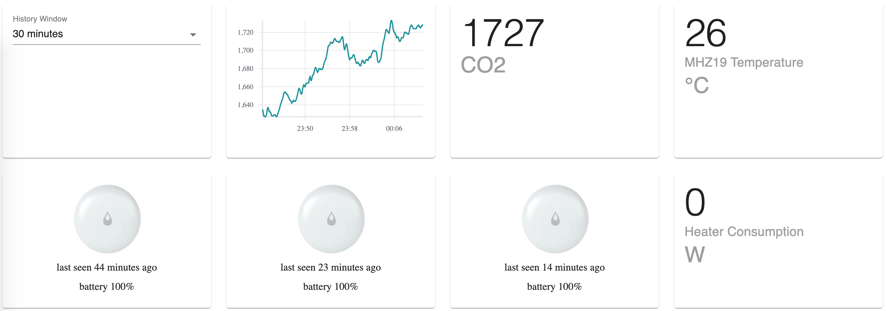

### Home automation server and playground for new technologies

This project has initially started as co2 sensor box with MQTT interface. But eventually evolved into simple home automation server and GUI.
CO2 sensor hardware is implemented on top of esp8266 ([firmware, written on lua](https://github.com/fedulovivan/interstellar/tree/master/nodemcu/mqtt.lua)), flashed with nodemcu and connected to MQTT broker [mosquitto](https://mosquitto.org/).
This GUI is also connected to MQTT broker. Zigbee devices support is enabled with help of [zigbee2mqtt](https://www.zigbee2mqtt.io/) project and chineeze clone of Texas Instruments CC2531 stick.
All received metrics are saved into coachdb which allows to browse historical data.
Browser part is implemented on react + emotion + materialui, parcel as module bundler.
Server side code is written in nodejs + typescript, babel as bundler/loader.
Browser-server communication is implemented as RPC layer over websockets.

### Used technologies

- [typescript](https://www.typescriptlang.org/index.html) 4.0
- [react](https://reactjs.org/) 16 and useSate, useEffect, useReducer [react hooks](https://reactjs.org/docs/hooks-intro.html)
- RPC layer implemented over [socket.io](https://socket.io/)
- [emotion](https://emotion.sh/) as styled components library
- [immer](https://immerjs.github.io/immer/docs/introduction) in reducer
- [parcel](https://parceljs.org/) with hot reload enabled
- [eslint](https://eslint.org/) with airbnb presets
- [couchdb](https://couchdb.apache.org/)
- [mqtt](https://www.npmjs.com/package/mqtt) client
- [materialui](https://material-ui.com/) 4
- [react-vis](https://uber.github.io/react-vis/) charting library
- [debug](https://www.npmjs.com/package/debug) module
- no redux, no create-react-app
- relative paths for imports

### UI screen

### Scripts

- `pm2 list` check status and uptime of server
- `yarn parcel:dev` - launch parcel in development more with hmr enabled
- `yarn server` - launch backend
- `yarn start` - launch two commands above simultaneusly
- `service mhz19 status` check service status

### TODOs

- why cssinjs? https://medium.com/jobsity/css-in-javascript-with-jss-and-react-54cdd2720222
- choosing cssinjs implementation - https://github.com/streamich/freestyler/blob/master/docs/en/generations.md

### Macmini power consumption history
20/11 228.56
21/11 228.91
22/11 229.25
23/11 229.55
24/11 229.90
25/11 230.25
26/11 230.59
27/11 230.96
